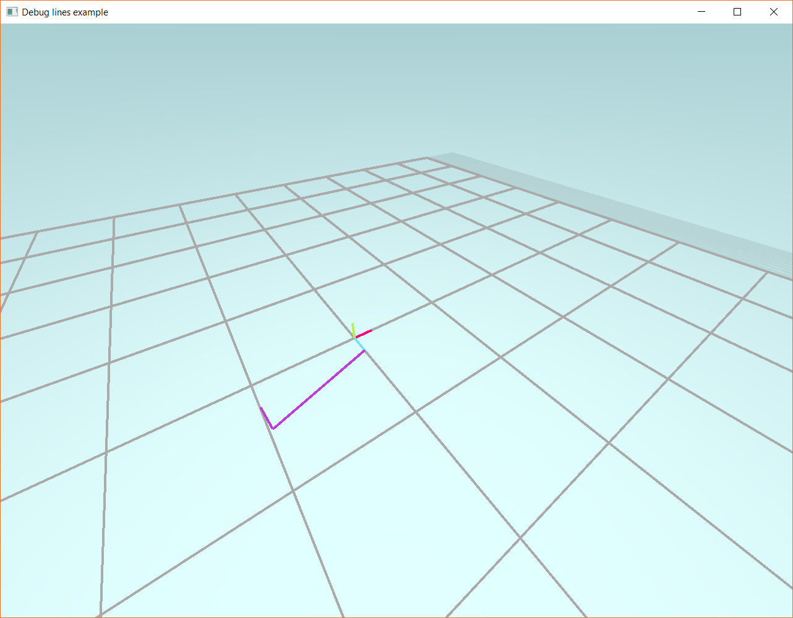

## Debug Lines

Renders debug lines with a 3D perspective via two separate methods: The
[`DebugLines`] [resource] and the [`DebugLinesComponent`] [component].
Internally, `DebugLines` is a wrapper around a `DebugLinesComponent`, but
they each have their separate, specific use cases.

The resource method is useful for rendering moving lines such as the purple ones
swinging in the middle of the example scene. This is because the `DebugLines`
resource is cleared immediately after being rendered (see its documentation),
allowing it to be updated easily frame-by-frame.

The component method, however, is useful for rendering persistent lines, such as
the grid pattern shown below. `DebugLinesComponent` is _not_ automatically
cleared on render, so one doesn't have to manually reset it with the same data
every frame if they desire static lines. The [`RenderDebugLines`]
[`RenderPlugin`] includes the necessary rendering [`System`] to automatically
render entities with a `DebugLinesComponent`.

Keybindings:

- `w` - Move forward
- `a` - Move left
- `s` - Move backwards
- `d` - Move left
- `e` - Move upwards
- `q` - Move downwards
- `mouse` - Rotate view

[component]: https://docs-src.amethyst.rs/stable/specs/trait.Component.html
[resource]: https://book-src.amethyst.rs/master/concepts/resource.html
[`debuglinescomponent`]: https://docs-src.amethyst.rs/stable/amethyst_rendy/debug_drawing/struct.DebugLinesComponent.html
[`debuglines`]: https://docs-src.amethyst.rs/stable/amethyst_rendy/debug_drawing/struct.DebugLines.html
[`renderdebuglines`]: https://docs-src.amethyst.rs/stable/amethyst_rendy/struct.RenderDebugLines.html
[`renderplugin`]: https://docs-src.amethyst.rs/stable/amethyst_rendy/trait.RenderPlugin.html
[`system`]: https://docs-src.amethyst.rs/stable/specs/trait.System.html
